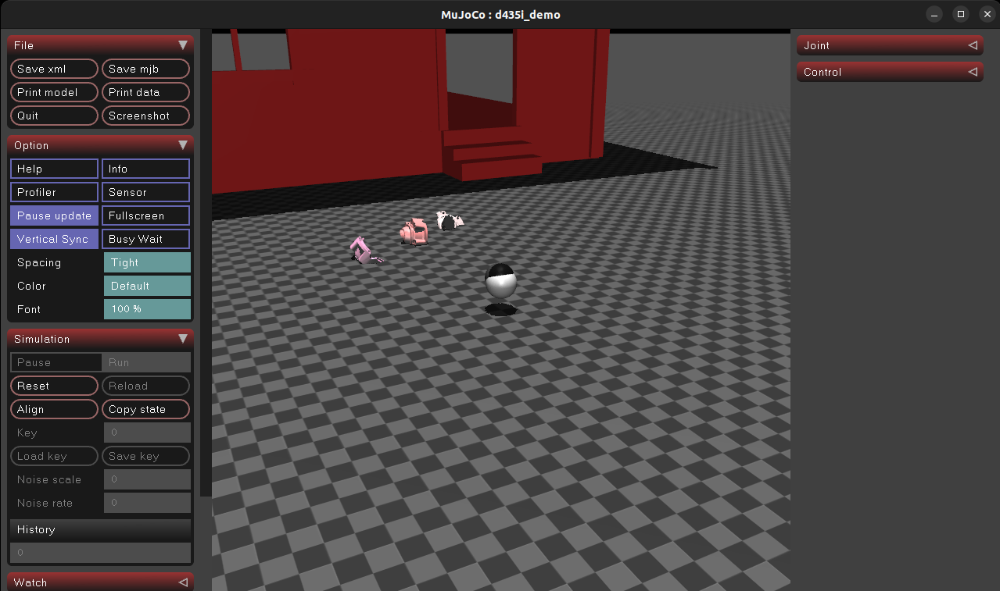
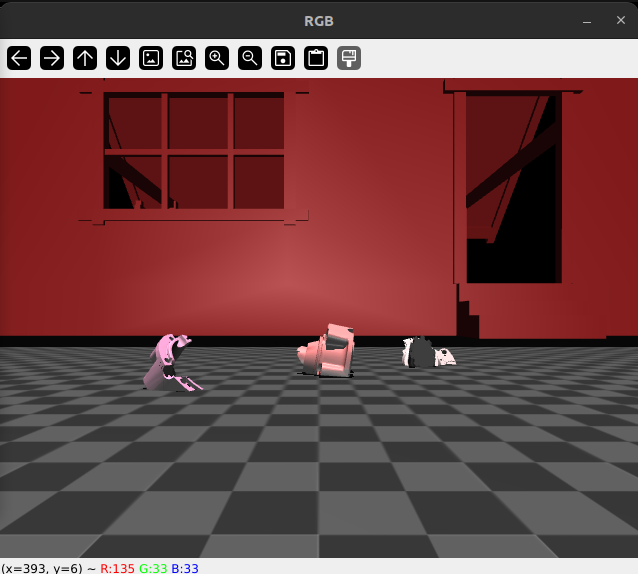
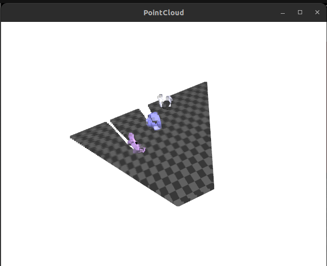

# generate grasp in MuJoCo



*MuJoCo‑powered RGB‑D camera + coloured point‑cloud export in < 100 lines of Python.*

---

## 1 · Что это

Этот репозиторий запускает виртуальную камеру **Intel RealSense D435i** в физическом движке **MuJoCo 3.x**. Скрипт `scripts/run.py`‑

- выводит поток **RGB** (OpenCV)

- визуализирует в реальном времени **point cloud** (Open3D)

- через `SAVE_AFTER` секунд сохраняет цветное облако точек в:
  - `cloud_000.ply` — бинарный PLY (сжатый)
  - `cloud_000.npy` — NumPy `float32[N,3]`

В сцене уже расставлены меши 🐰 `bunny`, 🐶 `dog`, 🐱 `cat` и дом 🏠 `house` для наглядности.

---

## 2 · Зависимости

- Python ≥ 3.9
- MuJoCo ≥ 3.1 (+ `pip install mujoco`)
- Open3D, OpenCV, NumPy
- (опц.) **Git LFS** — если храните большие PLY/NPY в репо

Все пакеты перечислены в `requirements.txt` — устанавливаются одной командой.

---

## 3 · Быстрый старт

```bash
# Клонируем (+ menagerie‑подмодуль для мешей)
git clone --recursive https://github.com/dakolzin/sim_d435
cd sim_d435

# Локальное окружение
python -m venv env && source env/bin/activate
pip install -r requirements.txt

# Запуск симуляции
python scripts/run.py
```

Через \~20 секунд в корне появятся `cloud_000.ply/.npy`.

---

## 4 · Структура

```
.
├── scripts/            # Точки входа
│   ├── run.py          # главный скрипт (см. ниже)
│   └── man.py          # вспом. утилиты (необязательно)
├── mjcf/               # MJCF‑сцена и ассеты
│   ├── test.xml        # камера + объекты + свет
│   └── assets/         # .obj/.stl (часть — symlink из external/menagerie)
├── frames/             # кадры, генерируемые скриптом (игнорируются Git’ом)
├── requirements.txt
└── README.md
```

---

## 5 · `run.py` — ключевые параметры

| Константа    | Значение по умолчанию | Назначение                              |
| ------------ | --------------------- | --------------------------------------- |
| `CAM`        | `"d435"`              | имя камеры в MJCF                       |
| `H, W`       | `480, 640`            | off‑screen рендер                       |
| `SAVE_AFTER` | `20.0` сек            | задержка перед автоматическим экспортом |
| `OUT_PLY`    | `cloud_000.ply`       | имя PLY‑файла                           |
| `OUT_NPY`    | `cloud_000.npy`       | имя NumPy‑файла                         |

Измените их прямо в коде или передавайте через переменные окружения.

---

## 6 · Повторное создание окружения

```bash
python -m venv env
source env/bin/activate
python -m pip install -r requirements.txt
```

Для **conda** вместо этого:

```bash
conda env create -f environment.yml && conda activate env
```

---

## 7 · To Do

- 🎮 CLI‑аргументы вместо хардкода
- 🖼️ рэндомизация поз и материалов объектов для датасетов
- 📦 Dockerfile + GitHub Actions

---
